# HexGenesis
A hexagonal cellular automaton universe simulation built with Swift and SpriteKit.
Explore how simple rules create complex behaviors in a virtual universe.

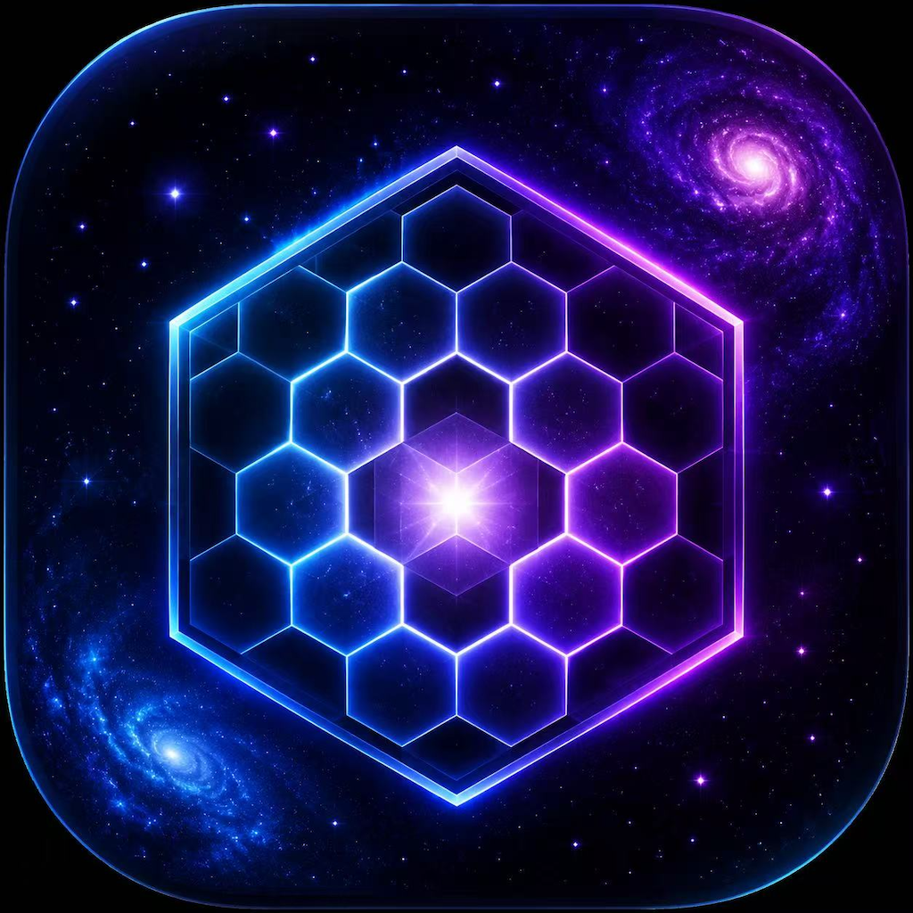

 Try HexGenesis Online: 
[English Web Demo](https://gelly-23.github.io/HexGenesis/HexGenesis-English.html)
[中文网页体验](https://gelly-23.github.io/HexGenesis/HexGenesis.html)

## Introduction

**HexGenesis** is a two-dimensional universe built on a hexagonal grid.

In HexGenesis, you can modify the rules and add initial elements, then
observe how they evolve inside the universe and explore the sparks of
emergent life that appear from simple systems.

## Project Status

🚧 HexGenesis is currently an experimental open-source project.

The core simulation engine is functional, and future versions will explore more complex evolution mechanisms.

------------------------------------------------------------------------

## Origin of HexGenesis

Many years ago, I encountered Conway's Game of Life. What amazed me was
this idea:

> By defining only a few simple rules inside a fixed grid structure,
> something resembling life can emerge.

The universe we live in is incredibly complex and mysterious. For
thousands of years, countless thinkers have tried to simplify our
understanding of reality, searching for the fundamental rules behind
everything.

Could the underlying structure and rules of our universe be as simple as
those in Conway's Game of Life?

Could all complexity and mystery emerge from simple structures and
simple rules?

Although we do not yet know the answer, we can create a small universe
based on a hexagonal grid, define its rules, and observe what happens.

------------------------------------------------------------------------

# The Hexagonal Universe

## Basic Concept

We imagine a two-dimensional universe composed of hexagonal cells.

Each hexagonal cell is both the space of the universe and the
fundamental element that constructs the universe.

------------------------------------------------------------------------

## Space Structure and Elements

In this universe, hexagonal space and elements share the same origin.
They only differ in their current state.

When a cell has no energy, it appears as the background color.

Energy states:

-   Energy 1: Green
-   Energy 2: Orange
-   Energy 3: Red (the highest energy state)

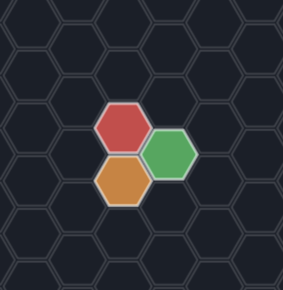

------------------------------------------------------------------------

## Evolution Rules

The state of each hexagonal cell is affected by the total energy of its
six neighboring cells.

The sum of neighboring energy values ranges from **0 to 18**.

Different energy sums create different effects on the current cell.

Default rules:

-   When the neighboring energy sum is **≤ 5**, the cell loses 1 energy
    level in the next generation until it reaches 0 (empty state).
-   When the neighboring energy sum is **6--9**, the cell gains 1 energy
    level until it reaches 3 (maximum energy state).
-   When the neighboring energy sum is **10--18**, the cell becomes 0
    energy in the next generation.

Players can adjust these values freely.

Summary:

-   The state of each cell is determined by the energy sum (**Sum**) of
    its six neighbors.

1.  **Decay**\
    `Sum ≤ limitLower` → Energy decreases by 1 level.

2.  **Growth**\
    `limitLower < Sum ≤ limitUpper` → Energy increases by 1 level.

3.  **Overload**\
    `Sum > limitUpper` → Energy becomes zero.

------------------------------------------------------------------------

# App Introduction

## Overview

Based on the HexGenesis concept above, I created an iOS demo application
using Swift with the assistance of AI.

HexGenesis can run on iPhone and iPad.

I also created a browser-based demo version so that users can experience
HexGenesis without installing the app.

## Try HexGenesis Online

You can experience the web version directly in your browser:

[English Web Demo](https://gelly-23.github.io/HexGenesis/HexGenesis-English.html)

[中文网页体验](https://gelly-23.github.io/HexGenesis/HexGenesis.html)

------------------------------------------------------------------------

## Interface and Controls

### Introduction and Login Screens

The introduction screen provides a brief explanation of HexGenesis. It
can be skipped.

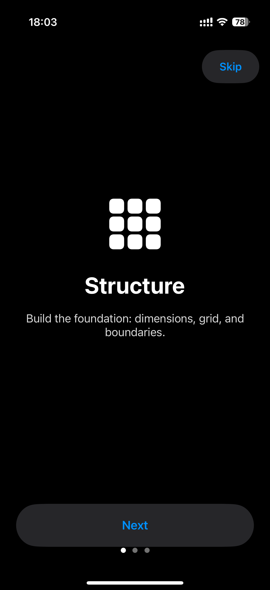
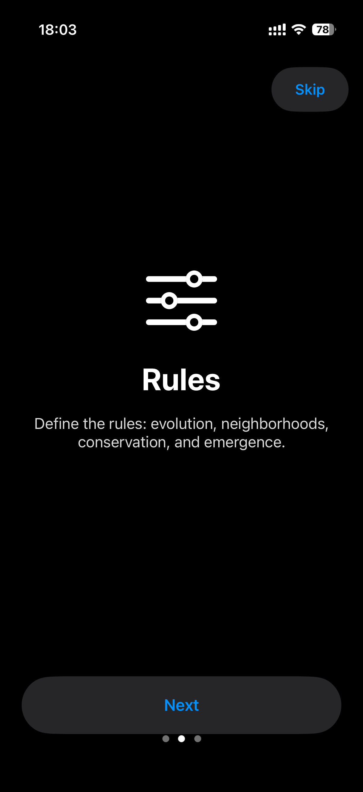
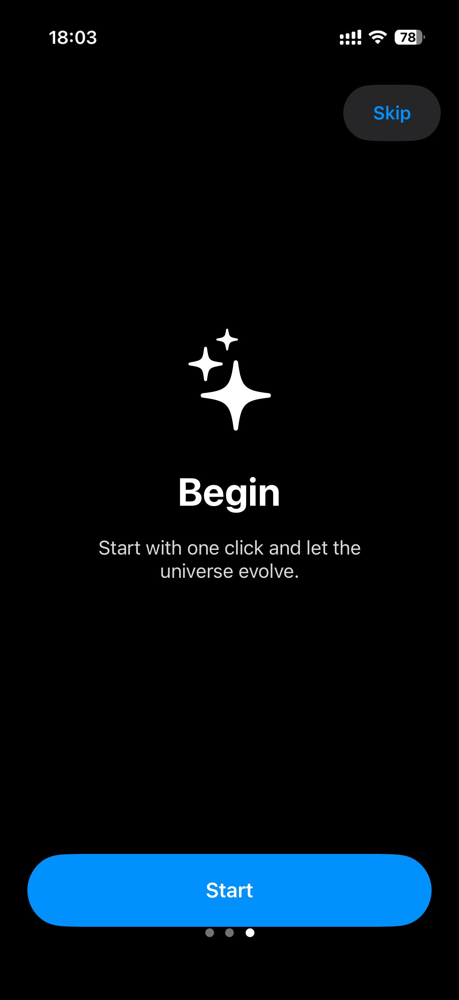

Because this is currently only a demo, the login system is not connected
to a real account system. Simply press login to enter the homepage and
start the game.

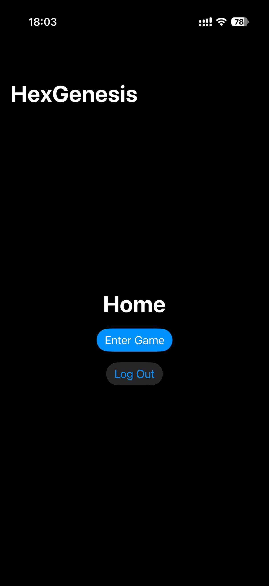

------------------------------------------------------------------------

## Main Game Interface

-   The button in the upper-right corner switches between two modes:
    -   Add Elements
    -   Move View

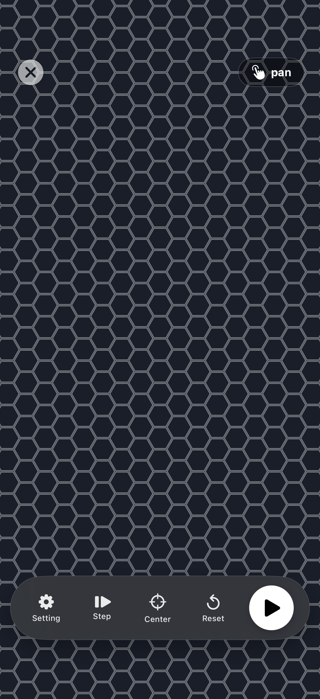
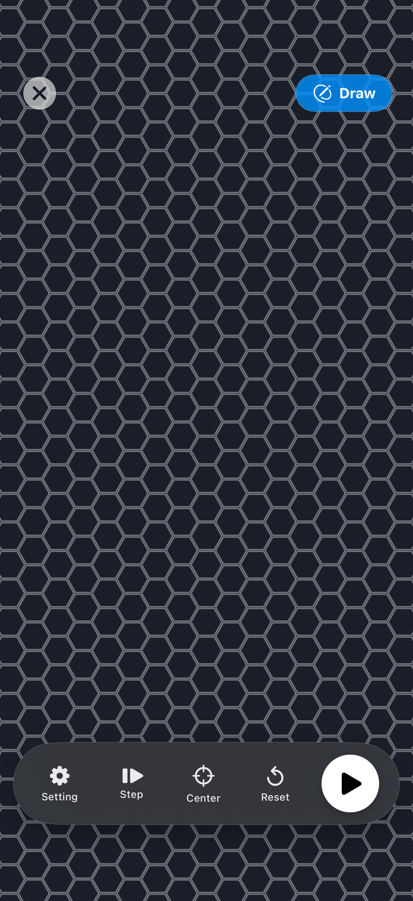

-   In **Add Elements** mode:
    -   Tap a cell to add a red element (energy level 3).
    -   Tap again to change it into orange (energy level 2).
    -   Tap again to change it into green (energy level 1).
    -   Press and drag to add multiple elements.
-   In **Move View** mode:
    -   Drag to move the universe.
    -   Use two fingers to zoom.
-   After adding elements:
    -   Press the play/start button in the lower-right corner to begin
        evolution.
    -   Press again to pause.
-   When paused:
    -   Press the reset button to clear all elements.
    -   Press the step button to evolve one generation at a time.
-   If the view moves far away:
    -   Press the center button to return to the initial position.

------------------------------------------------------------------------

# Settings

While paused, press the settings button to open the settings screen.

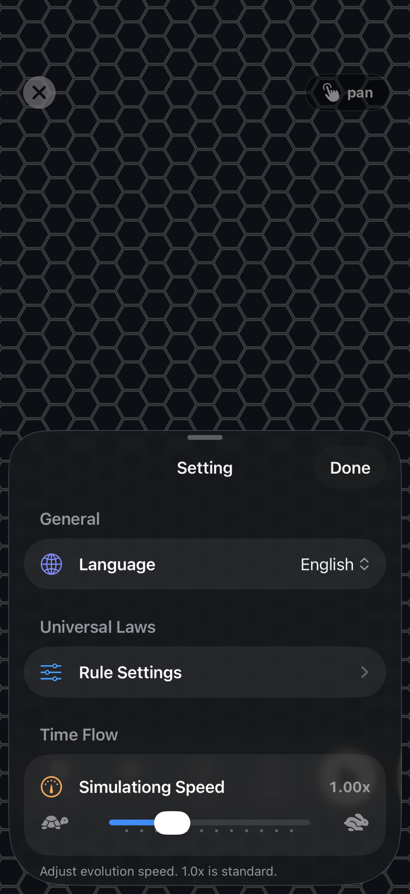

Settings include:

-   Language selection
-   Evolution speed adjustment
-   Evolution rule modification

Left column: - Controls the boundary values for element growth and
decay.

Right column: - Controls the boundary values for element growth and
overload.

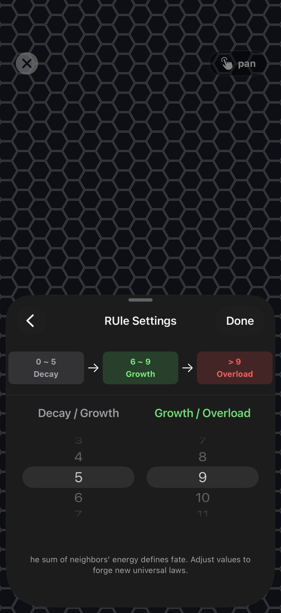

After changing the rules, return to the main screen, add elements, and
observe different evolution behaviors.

The web demo provides similar settings in the upper-left corner.

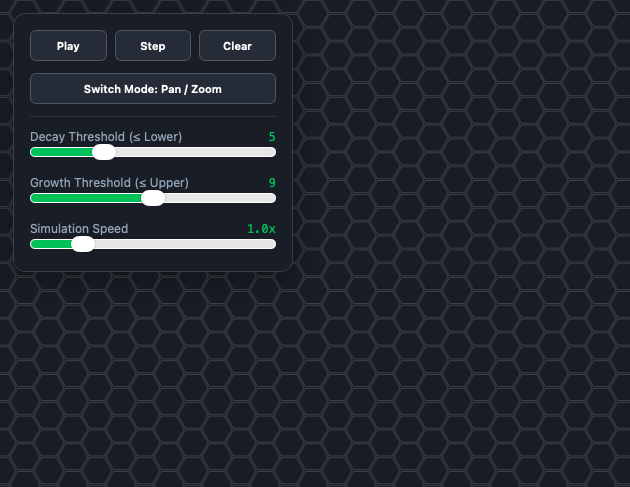

------------------------------------------------------------------------

# HexGenesis Evolution Examples

## Evolution Under Default Rules

The following examples use the default evolution rules.

-   Neighbor energy sum ≤ 5:
    -   The cell loses one energy level.
-   Neighbor energy sum 6--9:
    -   The cell gains one energy level.
-   Neighbor energy sum 10--18:
    -   The cell disappears.

Under these rules, elements do not grow endlessly and do not easily
become completely inactive.

Certain arrangements can survive for a long time.

Examples of stable structures:

------------------------------------------------------------------------

## Evolution Under Other Rules

I will continue adding more observations under different rule settings.

### Expanding the Overload Boundary

For example, increasing the overload limit to 18 allows groups of red
elements to remain stable.

They can form dense cores and consume surrounding elements.

### Expanding the Growth Boundary

For example, lowering the growth boundary to 4 causes elements to
rapidly expand across the universe.

In some cases, the expansion process creates fractal-like patterns.

------------------------------------------------------------------------

# Final Notes

If you are interested in HexGenesis, or discover new evolution patterns,
feel free to leave feedback.

Any discussion, suggestions, or ideas are welcome.

If you have explored HexGenesis, please let me know.

Thank you.
